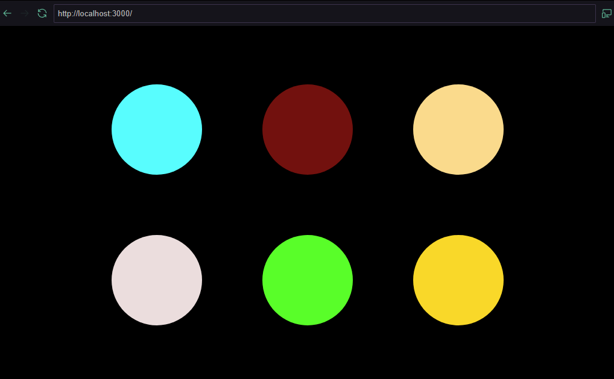
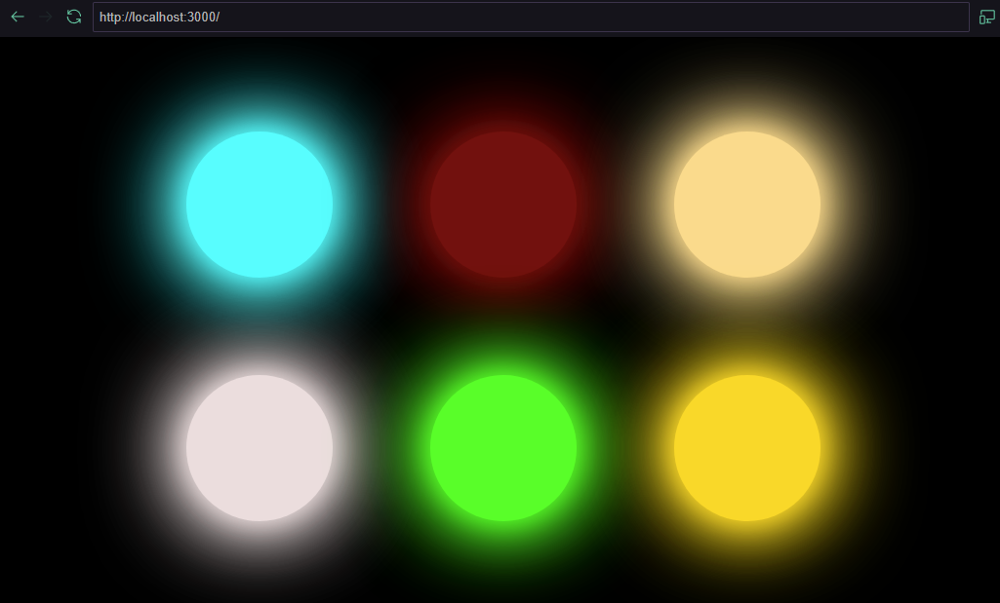
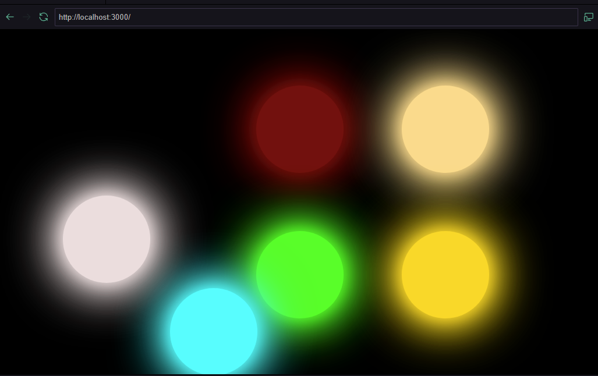

## Projeto do Componente Circle

Este projeto é uma demonstração simples de um componente React chamado `Circle`, construído usando Next.js. O componente `Circle` exibe um círculo colorido que pode ser clicado para aplicar um efeito de sombra e arrastado pela tela.

### Propósito

O propósito deste projeto é aprender e praticar os conceitos básicos de Next.

### Funcionalidades

- **Clique**: Clicar no círculo alterna seu estado entre clicado e não clicado, aplicando ou removendo um efeito de sombra.
- **Arrastar**: Quando o círculo está no estado clicado, ele pode ser arrastado pela tela.

## Prints

1. **Círculo Inicial**:

   


2. **Círculo com Efeito de Sombra**:

   


3. **Círculo sendo Arrastado**:

   


### Componentes

#### `Circle.jsx`

```jsx
import React, { useEffect, useRef, useState } from "react"

export default function Circle(props) {
  const circleRef = useRef(0)
  const [isDrag, setIsDrag] = useState()
  const [isClicked, setIsClicked] = useState(false)
  const [effect, setEffect] = useState({})

  useEffect(() => {
    const hexColor = props.color

    const style = {
      backgroundColor: hexColor,
      width: "150px",
      height: "150px",
      borderRadius: "300px",
    }

    const styleShadow = {
      boxShadow: `0px 0px 25px ${hexColor},
                  0px 0px 60px ${hexColor},
                  0px 0px 95px ${hexColor},
                  0px 0px 100px ${hexColor}`,
    }

    setEffect(isClicked ? { ...style, ...styleShadow } : style)
  }, [props.color, isClicked])

  useEffect(() => {
    const circle = circleRef.current

    const onClickMouse = () => {
      setIsClicked((prevClick) => !prevClick)
    }

    const onMouseDown = () => {
      if (isClicked) {
        setIsDrag(true)
      }
    }

    const onMouseUp = () => {
      setIsDrag(false)
    }

    const onMouseMove = (e) => {
      if (isDrag) {
        console.log("isDrag")
        const mouseX = e.clientX
        const mouseY = e.clientY

        const circleX = circle.offsetLeft + circle.offsetWidth / 2
        const circleY = circle.offsetTop + circle.offsetHeight / 2

        const deltaX = mouseX - circleX
        const deltaY = mouseY - circleY

        circle.style.transform = `translate(${deltaX}px, ${deltaY}px)`
      }
    }

    circle.addEventListener("mousedown", onMouseDown)
    circle.addEventListener("mouseup", onMouseUp)
    circle.addEventListener("mousemove", onMouseMove)
    circle.addEventListener("click", onClickMouse)

    return () => {
      circle.removeEventListener("mousedown", onMouseDown)
      circle.removeEventListener("mouseup", onMouseUp)
      circle.removeEventListener("mousemove", onMouseMove)
      circle.removeEventListener("click", onClickMouse)
    }
  }, [isDrag, isClicked])

  return (
    <div
      id="circle"
      ref={circleRef}
      style={{ backgroundColor: "#FFF" }}
      {...(effect && { style: effect })}
    ></div>
  )
} 
```

### `index.jsx`

```jsx
import Circle from "@/components/Circle"

export default function Home() {
  return (
    <div className="container">
      <Circle color={"#0FFFFF"} />
      <Circle color={"#770707"} />
      <Circle color={"#FFD988"} />
      <Circle color={"#ECDDDD"} />
      <Circle color={"#39FF14"} />
      <Circle color={"#FFD700"} />
    </div>
  )
}
```

### `global.css`

```css

* {
  padding: 0;
  margin: 0;
}

html {
  background-color: #222222;
}

body {
  display:flex;
  flex-direction: column;
  background-color: #000000;
}

.container {
  display: grid;
  height: 100vh;
  grid-template-columns: auto auto auto;
  align-items: center;
  place-content: center;
  column-gap: 100px;
  row-gap: 100px;
}

a {
  color: inherit;
  text-decoration: none;
}
```

## Uso

Para usar o componente `Circle` em sua aplicação Next.js, importe-o e passe uma prop color com o valor hexadecimal da cor desejada.

### `index.jsx`

```jsx
import Circle from "@/components/Circle"

export default function Home() {
  return (
    <div className="container">
      <Circle color={"#0FFFFF"} />
      <Circle color={"#770707"} />
      <Circle color={"#FFD988"} />
      <Circle color={"#ECDDDD"} />
      <Circle color={"#39FF14"} />
      <Circle color={"#FFD700"} />
    </div>
  )
}
```
